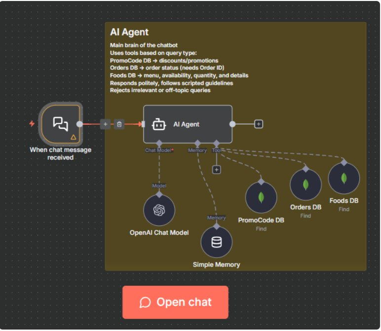
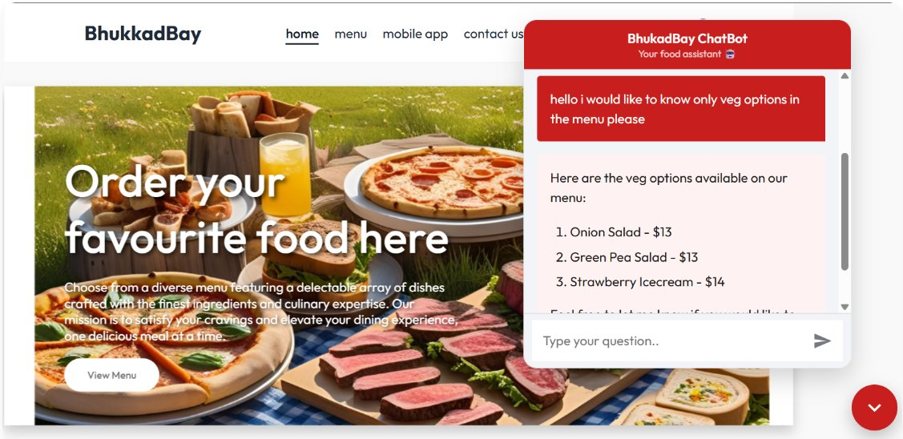
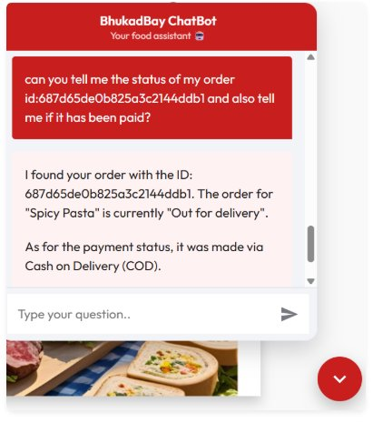
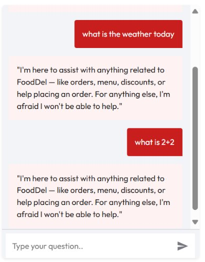

# BhukkadBay — n8n Orchestrated Food Ordering Platform

**BhukkadBay** is a full-stack food ordering platform with an AI-powered support chatbot orchestrated entirely through **n8n**. The chatbot connects to live MongoDB databases, understands natural language queries, and handles menu browsing, order tracking, and promo code lookups — completely automatically, without any manual support effort.

> The primary focus of this project is the **n8n automation workflow**, not the web app itself. The frontend serves as the real-world context in which the automation runs.

---

## Project Structure

```
n8n_Food-Del/
├── frontend/          # React customer-facing website (BhukkadBay)
├── admin/             # React admin dashboard
├── backend/           # Node.js + Express REST API
│   ├── models/        # MongoDB schemas (Food, Order, User, PromoCode, Review)
│   ├── controllers/   # Business logic
│   ├── routes/        # API endpoints
│   └── server.js      # Entry point
└── E-Commerce Support Chatbot.json   # n8n workflow (importable)
```

---

## The Main Feature: n8n Orchestrated Chatbot

The chatbot is embedded directly on the BhukkadBay website. Every customer message triggers an n8n workflow that uses **OpenAI** for natural language understanding and **MongoDB** for live data — making it both conversational and functional.

### n8n Workflow Architecture



The workflow consists of:
- **Chat Trigger** — receives messages from the website widget
- **AI Agent (OpenAI)** — understands intent and decides which tool to call
- **Simple Memory** — maintains conversation context across messages
- **MongoDB Tools** — three separate database connections:
  - `Foods DB` — menu items, pricing, availability
  - `Orders DB` — order status and payment info
  - `PromoCode DB` — active discounts and offers

---

## Chatbot Capabilities

### Menu Queries
Users can ask about food items, prices, dietary options, or availability. The chatbot queries the Foods collection in real time and responds with accurate, structured information.



---

### Order Status Tracking
When a user provides their Order ID, the chatbot connects to the Orders collection, checks the current status (preparing, out for delivery, completed), verifies payment method, and responds in natural language.



---

### Off-Topic Query Handling
The chatbot identifies irrelevant or unrelated questions and responds politely, redirecting users to relevant topics. It strictly stays within its defined scope.



---

### Promo Codes & Offers
Users can ask about active discounts and promotions. The chatbot reads from the PromoCode collection and returns current offers conversationally.

---

## Frontend Features (BhukkadBay)

The customer-facing website provides a full food ordering experience:

- Search bar with live filtering
- Cart system with add / remove / update
- Promo code application at checkout
- Stripe payment integration
- Ratings and reviews on past orders
- User authentication

## Admin Panel Features

- Add, edit, and remove menu items
- Stock management
- Promo code management (create, activate, deactivate)
- Order management and status updates
- Reports — item-wise sales and total overview

---

## How to Run

### Prerequisites
- Node.js
- MongoDB Atlas account
- n8n instance (cloud or self-hosted)
- OpenAI API key
- Stripe account

### Backend
```bash
cd backend
npm install
# Add your .env file with MONGO_URI, JWT_SECRET, STRIPE_SECRET_KEY
node server.js
```

### Frontend
```bash
cd frontend
npm install
npm run dev
```

### Admin
```bash
cd admin
npm install
npm run dev
```

### n8n Chatbot
1. Open your n8n instance
2. Go to **Workflows** → **Import**
3. Import `E-Commerce Support Chatbot.json`
4. Add your MongoDB Atlas and OpenAI credentials
5. Activate the workflow
6. Copy the Chat Trigger webhook URL into the frontend chatbot widget

---

## Environment Variables

Create a `.env` file in the `backend/` folder:

```env
MONGO_URI=your_mongodb_atlas_connection_string
JWT_SECRET=your_jwt_secret
STRIPE_SECRET_KEY=your_stripe_secret_key
```

---

*Built to explore real-world automation with n8n — using a food ordering platform as the foundation.*
